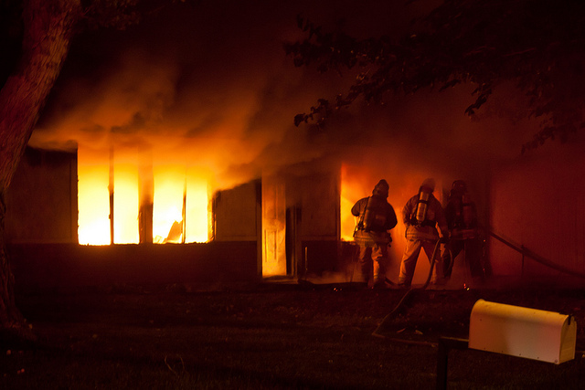
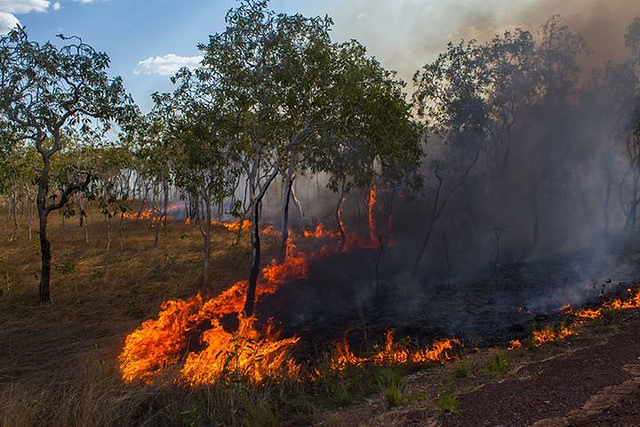
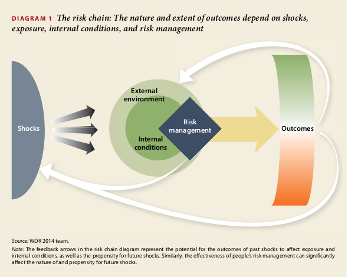
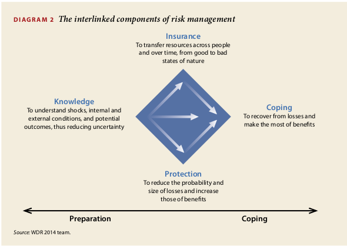
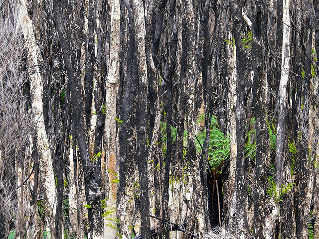

Fire risk in New South Wales, Australia
========================================================
css: custom.css
date: 2014-07-23
transition: rotate
transition-speed: slow
font-family: 'Helvetica'


Fire risk
========================================================
left: 30%

Building fire:
[](https://www.flickr.com/photos/adambelles/5044281763)
<p style="font-size:12px">Source is <a href="https://www.flickr.com/photos/adambelles/5044281763">Ada(m) Be(lles) on flickr</a>.</p>

Bushfire:
[](https://www.flickr.com/photos/epochcatcher/13936382630)
<p style="font-size:12px">Source is <a href="https://www.flickr.com/photos/epochcatcher/13936382630">Teddy Fotiou on flickr</a>.</p>

***

<p style="font-size:12px">World Bank. 2013.
World Development Report 2014: Risk and Opportunity—Managing Risk for
Development. Washington, DC: World Bank. doi: 10.1596/978-0-8213-9903–3.
License: Creative Commons Attribution CC BY 3.0</p>

Components of Risk management
========================================================
left: 70%


<p style="font-size:12px">World Bank. 2013.
World Development Report 2014: Risk and Opportunity—Managing Risk for
Development. Washington, DC: World Bank. doi: 10.1596/978-0-8213-9903–3.
License: Creative Commons Attribution CC BY 3.0</p>

***

This presentation focuses on **Knowledge**.

Coping example:
[](https://www.flickr.com/photos/davidbrewster/4031028473/in/set-72157622631238132)
<p style="font-size:12px">Source is <a href="https://www.flickr.com/photos/davidbrewster/4031028473/in/set-72157622631238132">David Brewster on flickr</a>.</p>

Summary of Fire Risks with Code
========================================================

<small>
The following table lists data related to fires which individual fire stations 
from the New South Wales Fire Brigades responded to and reported on.

```r
df <- read.csv("../shinyApp/building_fires.csv")
df <- aggregate(df[,6:10],by=list("Year"=df[,"Year_ending"]),FUN=sum)
names(df) <- c("Year","Building_fires","Total_fires","Casualties","Rescued","Evacuated")
df
```

```
  Year Building_fires Total_fires Casualties Rescued Evacuated
1 2004           6276       31991        991     239     20332
2 2005           6060       32710        888     165     19435
3 2006           6465       35256        893     213     24239
4 2007           6184       32553        963     222     32038
```
</small>
<p style="font-size:12px">
The source of information
on the number of fires, casualties, and people evacuated 
and rescued from fire corresponding to individual fire stations 
was Fire & Rescue NSW, New South Wales, 
Annual Statistical Reports, Fire Brigades (NSW) 2003 to 2007.
The data was downloaded on 2014-07-22 at 10:30am. 
The original data source and more documentation on the variables are at 
http://www.fire.nsw.gov.au/page.php?id=171. I used this
<a href="https://github.com/Tatlov/data_products_project/blob/master/get_and_clean.R"> script </a> to obtain, clean and combine the data.
</p>

Explore data related to fires in NSW
========================================================
title: FALSE
Try [my App](http://tatlov.shinyapps.io/shinyApp) to explore the data!

<iframe style="border:8px solid #111111" src="http://tatlov.shinyapps.io/shinyApp" width="800" height="500"></iframe>

Are you prepared? [See what the experts say.](http://www.fire.nsw.gov.au/page.php?id=879)
